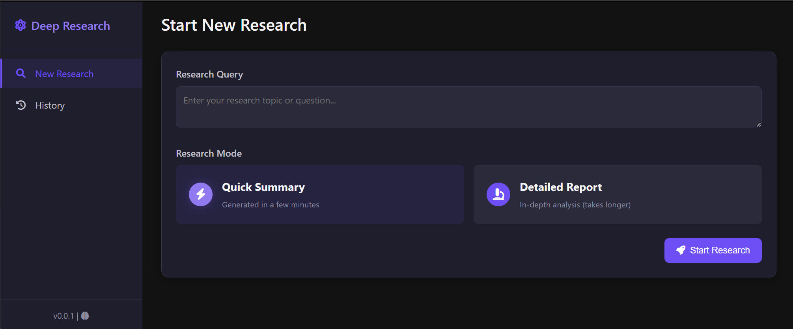

# Local Deep Research

A powerful AI-powered research assistant that performs deep, iterative analysis using multiple LLMs and web searches. The system can be run locally for privacy or configured to use cloud-based LLMs for enhanced capabilities.

## Quick Start

```bash
# Install the package
pip install local-deep-research

# Install required browser automation tools
playwright install

# For local models, install Ollama
# Download from https://ollama.ai and then pull a model
ollama pull gemma3:12b
```

Then run:

```bash
# Start the web interface (recommended)
ldr-web # (OR python -m local_deep_research.web.app)

# OR run the command line version
ldr # (OR python -m local_deep_research.main)
```

Access the web interface at `http://127.0.0.1:5000` in your browser.

## Features

- 🔍 **Advanced Research Capabilities**
  - Automated deep research with intelligent follow-up questions
  - Proper inline citation and source verification
  - Multi-iteration analysis for comprehensive coverage
  - Full webpage content analysis (not just snippets)

- 🤖 **Flexible LLM Support**
  - Local AI processing with Ollama models
  - Cloud LLM support (Claude, GPT)
  - Supports all Langchain models
  - Configurable model selection based on needs

- 📊 **Rich Output Options**
  - Detailed research findings with proper citations
  - Well-structured comprehensive research reports
  - Quick summaries for rapid insights
  - Source tracking and verification

- 🔒 **Privacy-Focused**
  - Runs entirely on your machine when using local models
  - Configurable search settings
  - Transparent data handling

- 🌐 **Enhanced Search Integration**
  - **Auto-selection of search sources**: The "auto" search engine intelligently analyzes your query and selects the most appropriate search engine
  - Multiple search engines including Wikipedia, arXiv, PubMed, Semantic Scholar, and more
  - **Local RAG search for private documents** - search your own documents with vector embeddings
  - Full webpage content retrieval and intelligent filtering

- 🎓 **Academic & Scientific Integration**
  - Direct integration with PubMed, arXiv, Wikipedia, Semantic Scholar
  - Properly formatted citations from academic sources
  - Report structure suitable for literature reviews
  - Cross-disciplinary synthesis of information

## Configuration System

The package automatically creates and manages configuration files in your user directory:

- **Windows**: `Documents\LearningCircuit\local-deep-research\config\`
- **Linux/Mac**: `~/.config/local_deep_research/config/`

### Default Configuration Files

When you first run the tool, it creates these configuration files:

| File | Purpose |
|------|---------|
| `settings.toml` | General settings for research, web interface, and search |
| `llm_config.py` | Configure which LLM to use (local or cloud-based) |
| `search_engines.toml` | Define and configure search engines |
| `local_collections.toml` | Configure local document collections for RAG |
| `.secrets.toml` | Store API keys for cloud services |

## Setting Up AI Models

The system supports multiple LLM providers:

### Local Models (via Ollama)

1. [Install Ollama](https://ollama.ai) 
2. Pull a model: `ollama pull gemma3:12b` (recommended model)
3. Ollama runs on port 11434 by default

### Cloud Models

Edit your `.secrets.toml` file to add API keys:

```toml
ANTHROPIC_API_KEY = "your-api-key-here"      # For Claude models
OPENAI_API_KEY = "your-openai-key-here"      # For GPT models
OPENAI_ENDPOINT_API_KEY = "your-key-here"    # For OpenRouter or similar services
```

Then edit `llm_config.py` to change the default provider:

```python
# Set your preferred model provider here
DEFAULT_PROVIDER = ModelProvider.OLLAMA  # Change to your preferred provider

# Set your default model name here
DEFAULT_MODEL = "mistral"  # Change to your preferred model
```

### Supported LLM Providers

The system supports multiple LLM providers:

| Provider | Type | Configuration | Notes |
|----------|------|--------------|-------|
| `OLLAMA` | Local | No API key needed | Default - install from ollama.ai |
| `OPENAI` | Cloud | Requires `OPENAI_API_KEY` | GPT models (3.5, 4, 4o) |
| `ANTHROPIC` | Cloud | Requires `ANTHROPIC_API_KEY` | Claude models (3 Opus, Sonnet, Haiku) |
| `OPENAI_ENDPOINT` | Cloud | Requires `OPENAI_ENDPOINT_API_KEY` | For any OpenAI-compatible API |
| `VLLM` | Local | No API key needed | For hosting models via vLLM |

You can configure the OpenAI-compatible endpoint URL in `llm_config.py`:

```python
# For OpenRouter, Together.ai, Azure OpenAI, or any compatible endpoint
OPENAI_ENDPOINT_URL = "https://openrouter.ai/api/v1"
```

The `OPENAI_ENDPOINT` provider can access any service with an OpenAI-compatible API, including:
- OpenRouter (access to hundreds of models)
- Azure OpenAI
- Together.ai
- Groq
- Anyscale
- Self-hosted LLM servers with OpenAI compatibility
- Any other service that implements the OpenAI API specification

## Setting Up Search Engines

The system includes multiple search engines. Some require API keys:

```toml
# Add to .secrets.toml
SERP_API_KEY = "your-serpapi-key-here"        # For Google results via SerpAPI
GOOGLE_PSE_API_KEY = "your-google-key-here"   # For Google Programmable Search
GOOGLE_PSE_ENGINE_ID = "your-pse-id-here"     # For Google Programmable Search
BRAVE_API_KEY = "your-brave-search-key-here"  # For Brave Search
GUARDIAN_API_KEY = "your-guardian-key-here"   # For The Guardian
```

No API key required for: Wikipedia, arXiv, PubMed, Semantic Scholar, and local collections.

## Local Document Search (RAG)

The system can search through your local documents using vector embeddings.

### Setting Up Document Collections

1. Define collections in `local_collections.toml`. Default collections include:

```toml
[project_docs]
name = "Project Documents"
description = "Project documentation and specifications"
paths = ["@format ${DOCS_DIR}/project_documents"]
enabled = true
embedding_model = "all-MiniLM-L6-v2"
embedding_device = "cpu"
embedding_model_type = "sentence_transformers"
max_results = 20
max_filtered_results = 5
chunk_size = 1000
chunk_overlap = 200
cache_dir = "__CACHE_DIR__/local_search/project_docs"

# More collections defined in the file...
```

2. Create your document directories:
   - The `${DOCS_DIR}` variable points to a default location in your Documents folder
   - Documents are automatically indexed when the search is first used

### Using Local Search

You can use local document search in several ways:

1. **Auto-selection**: Set `tool = "auto"` in `settings.toml` [search] section
2. **Explicit collection**: Set `tool = "project_docs"` to search only that collection
3. **All collections**: Set `tool = "local_all"` to search across all collections
4. **Query syntax**: Type `collection:project_docs your query` to target a specific collection

## Available Search Engines

| Engine | Purpose | API Key Required? | Rate Limit |
|--------|---------|-------------------|------------|
| `auto` | Intelligently selects the best engine | No | Based on selected engine |
| `wikipedia` | General knowledge and facts | No | No strict limit |
| `arxiv` | Scientific papers and research | No | No strict limit |
| `pubmed` | Medical and biomedical research | No | No strict limit |
| `semantic_scholar` | Academic literature across all fields | No | 100/5min |
| `github` | Code repositories and documentation | No | 60/hour (unauthenticated) |
| `brave` | Web search (privacy-focused) | Yes | Based on plan |
| `serpapi` | Google search results | Yes | Based on plan |
| `google_pse` | Custom Google search | Yes | 100/day free tier |
| `wayback` | Historical web content | No | No strict limit |
| `searxng` | Local web search engine | No (requires local server) | No limit |
| Any collection name | Search your local documents | No | No limit |

> **Support Free Knowledge:** If you frequently use the search engines in this tool, please consider making a donation to these organizations. They provide valuable services and rely on user support to maintain their operations:
> - [Donate to Wikipedia](https://donate.wikimedia.org)
> - [Support arXiv](https://arxiv.org/about/give)
> - [Donate to DuckDuckGo](https://duckduckgo.com/donations)
> - [Support PubMed/NCBI](https://www.nlm.nih.gov/pubs/donations/donations.html)

## Advanced Configuration

### Research Parameters

Edit `settings.toml` to customize research parameters:

```toml
[search]
# Search tool to use (auto, wikipedia, arxiv, etc.)
tool = "auto"

# Number of research cycles
iterations = 2

# Questions generated per cycle
questions_per_iteration = 2

# Results per search query
max_results = 50

# Results after relevance filtering
max_filtered_results = 5

# More settings available...
```

## Web Interface

The web interface offers several features:

- **Dashboard**: Start and manage research queries
- **Real-time Updates**: Track research progress
- **Research History**: Access past queries
- **PDF Export**: Download reports
- **Research Management**: Terminate processes or delete records




## Command Line Interface

The CLI version allows you to:

1. Choose between a quick summary or detailed report
2. Enter your research query
3. View results directly in the terminal
4. Save reports automatically to the configured output directory

## Development Setup

If you want to develop or modify the package, you can install it in development mode:

```bash
# Clone the repository
git clone https://github.com/LearningCircuit/local-deep-research.git
cd local-deep-research

# Install in development mode
pip install -e .
```

This creates an "editable" installation that uses your local code, so any changes you make are immediately available without reinstalling.

You can run the application directly using Python module syntax:

```bash
# Run the web interface
python -m local_deep_research.web.app

# Run the CLI version
python -m local_deep_research.main
```

This approach is useful for development and debugging, as it provides more detailed error messages and allows you to make code changes on the fly.

## Example Research

The repository includes complete research examples like our [fusion energy research analysis](https://github.com/LearningCircuit/local-deep-research/blob/main/examples/fusion-energy-research-developments.md) showcasing the system's capabilities.

## Community & Support

Join our [Discord server](https://discord.gg/2E6gYU2Z) to exchange ideas, discuss usage patterns, and share research approaches.

## License

This project is licensed under the MIT License.

## Acknowledgments

- Built with [Ollama](https://ollama.ai) for local AI processing
- Search powered by multiple sources:
  - [Wikipedia](https://www.wikipedia.org/) for factual knowledge (default search engine)
  - [arXiv](https://arxiv.org/) for scientific papers
  - [PubMed](https://pubmed.ncbi.nlm.nih.gov/) for biomedical literature
  - [DuckDuckGo](https://duckduckgo.com) for web search
  - [The Guardian](https://www.theguardian.com/) for journalism
  - [SerpAPI](https://serpapi.com) for Google search results (requires API key)
  - [SearXNG](https://searxng.org/) for local web-search engine
  - [Brave Search](https://search.brave.com/) for privacy-focused web search
  - [Semantic Scholar](https://www.semanticscholar.org/) for academic literature
- Built on [LangChain](https://github.com/hwchase17/langchain) framework
- Uses [justext](https://github.com/miso-belica/justext), [Playwright](https://playwright.dev), [FAISS](https://github.com/facebookresearch/faiss), and more

## Contributing

Contributions are welcome! Please feel free to submit a Pull Request.

1. Fork the repository
2. Create your feature branch (`git checkout -b feature/AmazingFeature`)
3. Commit your changes (`git commit -m 'Add some AmazingFeature'`)
4. Push to the branch (`git push origin feature/AmazingFeature`)
5. Open a Pull Request
